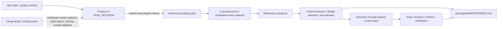

# Reference Intelligence architecture

Agentit treats external references as a first-class, traceable input to engineering, design, product, marketing, launch, research, and tool-selection work.

The goal is **not** to accumulate links. The goal is to turn useful external knowledge into durable project decisions without losing provenance, authority, freshness, licensing, or the boundary between inspiration and evidence.

## Why this exists

Agents commonly fail around external references in several predictable ways:

1. a viral social post is silently promoted into a factual premise;
2. a good-looking design is copied rather than analyzed and synthesized;
3. hundreds of prompts/resources are dumped into context instead of distilled into procedures;
4. an external package/skill/MCP is installed because it looks useful without checking overlap, license, maintenance, security, or project fit;
5. a reference materially shapes a project but the next agent cannot discover where the decision came from;
6. dynamic configuration/pricing/API claims become stale while the repository keeps treating them as current.

Reference Intelligence creates explicit structure for those problems.

## Architecture



### Semantic ownership

The **primary AI** owns semantic source/pack selection. `router/reference_catalog.py` is intentionally mechanical. It can:

- validate the catalog;
- list/filter source metadata by explicit fields;
- return one explicit source;
- return one explicit named pack;
- summarize counts/policy.

It cannot take arbitrary natural-language task text and decide which references apply. That would recreate the programmatic semantic router Agentit deliberately removed.

### Catalog

`references/catalog.yaml` contains:

- source identity and URLs;
- domain/tags;
- evidence role;
- verification status/date;
- a concise summary;
- durable takeaways;
- cautions / non-inferences;
- integration disposition/targets;
- named packs that compress many bookmarks into a few reusable contexts.

The initial catalog is deliberately seeded with the 27-source X bookmark research that motivated this layer. New references should be added because they improve a durable workflow, not because a feed produced another interesting link.

### Evidence roles

Agentit distinguishes:

- **canonical** — official docs/spec/canonical repository for the thing being used;
- **licensed artifact** — inspectable reusable artifact with reviewed license;
- **corroborated** — factual claim independently supported;
- **creator claim** — creator/vendor/post author says it; useful lead, not independent proof;
- **inspiration** — pattern/taste/idea source, not factual authority;
- **unverified** — insufficient evidence for a project premise.

This classification is part of the decision, not decorative metadata.

## Project-local provenance

When external material **materially changes** architecture, product behavior, visual direction, process, dependency selection, or a durable business/technical decision, Agentit must leave a reference ledger.

Reuse an existing project equivalent when present. Otherwise the default is:

```text
docs/agentit/REFERENCES.md
```

A template lives at `templates/project/REFERENCES.md`.

The ledger records:

```text
source -> authority role -> extracted principle -> project decision -> affected paths -> verification date
```

It also records anti-copy/non-inference boundaries, attribution/license obligations, and re-verification triggers where relevant.

The ledger is **not** a transcript, browser history, raw chain-of-thought, or giant list of links.

## Relationship to other Agentit systems

### `source-driven-development`

Authoritative implementation correctness. Framework/library/standard behavior should still be checked against current official docs. Reference Intelligence does not downgrade that hierarchy.

### Design stack

`design-inspiration-research` consumes references as design DNA and produces `INSPIRATION_SYNTHESIS` plus `REFERENCE_TO_DECISION_MAP`. `design-taste-frontend` / `impeccable-design` own art direction and critique. Browser tooling owns rendered evidence.

External galleries, 21st.dev, Checklist Design, Hallmark-derived discipline, and microinteraction collections therefore have distinct jobs rather than becoming one giant design prompt.

### MCP catalog

MCPs are tools, not references. A reference can reveal a useful MCP, but catalog promotion requires current setup/auth/security evidence. `mcp/catalog.d/*.yaml` allows reviewed optional additions without inflating the monolithic base catalog.

21st.dev is the first overlay introduced by the bookmark audit because its current official MCP/CLI is directly useful to Agentit's frontend/design workflow. Helena remains an architecture/candidate reference until its current installable integration contract is verified well enough for Agentit's MCP catalog.

### Loop/Graph runtime

References influence **how we choose a plan**; receipts verify **whether the executed plan worked**. A reference is never a substitute for a verifier.

### Documentation contract

The reference ledger complements architecture/ADR/component/operations documentation. It answers a different question:

> Which external knowledge materially shaped this decision, what exactly did we take from it, and what did we deliberately not infer/copy?

## Adoption lifecycle for external artifacts

```text
DISCOVER -> VERIFY -> CLASSIFY -> COMPARE -> ADOPT / ADAPT / COMPOSE / REFERENCE / INCUBATE / REJECT / BUILD
```

### ADOPT

Use largely as-is after maintenance/license/security/dependency/project-fit review.

### ADAPT

Reuse licensed material but deliberately integrate it into an existing Agentit/project responsibility. Preserve attribution.

### COMPOSE

Use smaller existing pieces instead of a monolithic external solution.

### REFERENCE ONLY

Keep the principle/reference without introducing runtime dependencies or competing process ownership.

### INCUBATE

Promising, but not ready because setup, evidence, license, security, overlap, or current availability is unresolved.

### REJECT

The cost/risk/overlap is greater than the value.

### BUILD

Custom implementation only after credible existing options were searched and rejected.

## Freshness rules

Re-verify a source when the decision depends on information that can plausibly change, especially:

- current APIs/MCP endpoints/auth;
- prices/free tiers/rate limits;
- model names/capabilities;
- browser support;
- regulations/platform rules;
- package maintenance/license/security state;
- vendor/product availability.

The catalog's `checked_at` is evidence of the last review, not a permanent truth certificate.

## Design anti-copy contract

Design references are decomposed into dimensions—structure, hierarchy, type, material, imagery, interaction, motion, responsive strategy—and recombined around the target project's own content/brand/constraints.

Do not:

- clone a distinctive site wholesale;
- copy proprietary assets or copy;
- invent metrics/testimonials/logos to satisfy a borrowed composition;
- redraw fake product/browser/phone chrome as evidence;
- treat a design gallery as proof of conversion/business performance.

## Marketing and launch feedback contract

Marketing/reference workflows become valuable when they close the loop:

```text
observe real data
  -> diagnose
  -> propose/execute within permissions
  -> define outcome metric
  -> schedule follow-up
  -> evaluate
  -> update compact learning
  -> retry / stop / escalate
```

A 'self-improving' workflow may improve stored strategy/procedure/context from measured evidence. It must not silently weaken budget, factuality, approval, security, or verification boundaries.

## CLI

Examples for agents/maintainers:

```bash
agentit refs summary
agentit refs packs
agentit refs pack web-design-studio
agentit refs show matt-pocock-skills
agentit refs list --domain design
agentit refs list --evidence-level canonical
agentit refs validate
```

There is intentionally no command such as:

```text
agentit refs recommend "build me a premium landing page"
```

Semantic reference selection belongs to the primary AI after inspecting the actual task/project context.

## Adding a new reference

A new catalog entry should answer:

1. What is the source?
2. What authority does it actually have?
3. What did we verify, and when?
4. What durable principle survives beyond the post/tool hype cycle?
5. What must we **not** infer from it?
6. Does it change an existing pack/workflow?
7. Is it reference-only, adapted, adopted, incubating, rejected, or learning-only?
8. If code/skills are reused, is the license compatible and attribution preserved?

If those questions cannot be answered, leaving the URL in personal bookmarks is better than putting it into Agentit's operating system.
